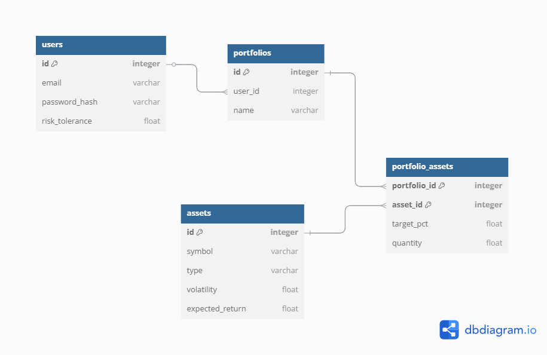

# Currency Rebalancer API

Currency Rebalancer API — это RESTful сервис для управления инвестиционными портфелями, разработанный на базе FastAPI. Проект предоставляет следующие возможности:
- Регистрация и аутентификация пользователей.
- Управление финансовыми активами.
- Создание, редактирование и удаление портфелей.
- Ребалансировка портфеля с использованием оптимизации методом Марковица (с поддержкой CVXPY).
- Получение цен активов с историей их изменения через CoinGecko API.
- Миграции базы данных с помощью Alembic.

## Особенности

- **Пользователи:** регистрация, вход, получение информации о текущем пользователе.
- **Активы:** создание актива, получение списка, поиск по ID.
- **Портфели:** создание портфеля, управление активами, ребалансировка.
- **Ребалансировка:** расчет оптимальных весов активов с учетом заданного уровня риска.
- **Миграции БД:** создание и изменение схемы базы данных.

## Технологии

- Python 3.13
- FastAPI
- SQLAlchemy
- Pydantic
- Alembic
- CVXPY
- HTTPX, Pandas
- Uvicorn

## Установка

1. **Клонируйте репозиторий:**

   ```sh
   git clone https://github.com/herman-mst/fastapi-currency-rebalancer
   cd fastapi-currency-rebalancer
   ```

2. **Создайте виртуальное окружение и активируйте его:**

    **С использованием venv:**

    ```sh
    python -m venv venv
    # Для Windows
    venv\Scripts\activate
    # Для Linux/macOS
    source venv/bin/activate
    ```

    **С использованием conda:**

    ```sh
    conda create -n fastapi-env python=3.13 -y
    conda activate fastapi-env
    ```

3. **Установите зависимости:**

   ```sh
   pip install -r requirements.txt
   ```

4. **Настройте переменные окружения:**

    Создайте файл `.env` в корне проекта (пример ниже):

    ```sh
    # URL для подключения к базе данных
    DATABASE_URL=sqlite:///./dev.db

    # Секретный ключ для генерации JWT токенов
    JWT_SECRET_KEY=your-secret-key

    # Алгоритм шифрования для JWT токенов
    JWT_ALGORITHM=HS256

    # Время жизни JWT токена в минутах
    ACCESS_TOKEN_EXPIRE_MINUTES=60

    # URL для доступа к API CoinGecko
    COINGECKO_API=https://api.coingecko.com/api/v3

    # Максимальное количество попыток при запросах к внешним API
    MAX_RETRIES=3
    ```

## Запуск проекта

Запустите Uvicorn с указанием модуля приложения:

```sh
uvicorn app.main:app --reload
```

Проект будет доступен по адресу: [http://127.0.0.1:8000](http://127.0.0.1:8000)

## Миграции

Для управления изменениями схемы базы данных используется Alembic. Рекомендуемые команды:

- Создание новой миграции (после внесения изменений в модели):
  ```sh
  alembic revision --autogenerate -m "Описание изменений"
  ```
- Применение миграций к базе данных:
  ```sh
  alembic upgrade head
  ```

## ER Диаграмма

Ниже приведена ER-диаграмма базы данных проекта:



## Тестирование

Запустите тесты с помощью Pytest:

```sh
pytest
```

## Дополнительная информация

- Документация API доступна по адресу: [http://127.0.0.1:8000/docs](http://127.0.0.1:8000/docs)
- Для получения дополнительной информации и решения возникших вопросов, пожалуйста, обратитесь к разработчикам.
